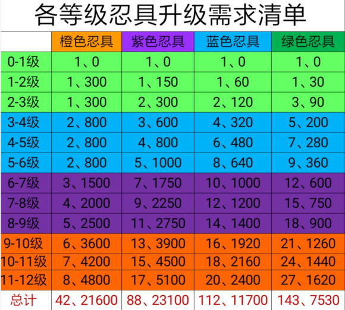

# 战力系统-忍具

## 忍具细节

1、开服博人传活动必须刷满，多余忍具兑换的忍具积分足够橙色忍具升级，你会发现最缺的是锻造石，而不是忍具

2、忍具商店每周购买我爱罗葫芦(直到升满)

3、优先升级：伏击>奥义=傀儡?急救

伏击12：第四回合增加一次普攻，打猫和服止水可加20%火攻，必备

急救12：第四回合回复12%血量，平时经常打到第四回合可优先急救，反之则先奥义傀儡

4、忍具2手增加暴击，3手增加爆伤，打丰饶和九尾的时候可根据自身条件选择主C手位

## 生存探险细节

1、非神豪推荐每个购买点购买4次(60点券)

2、低氪不要扫荡！一次30点券，一个月可省900点券。

3、兑换材料最前期可换锻造石，中期补齐音忍图鉴后兑换封印碎片，后期随意

## 忍具升级材料汇总

引自：[忍具升级材料汇总](https://tieba.baidu.com/p/6475303000)

发表时间：2020-10-17 

作者：都都

###  