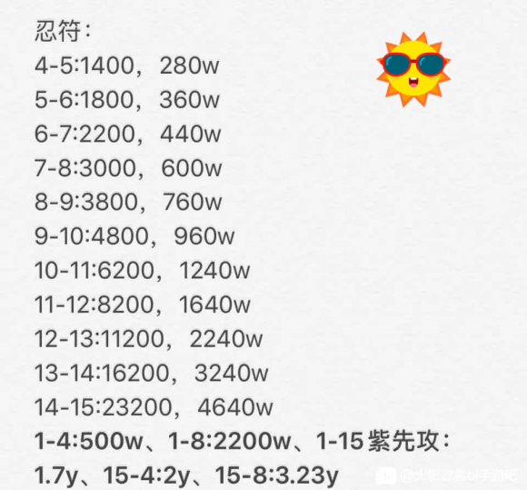

# 战力系统-忍符

## 忍符细节：

1、策划直播反馈忍符只会有四套，万能符战力最高搭配为4忍+4体，实战搭配根据阵容选择。

2、需要刷忍符推荐一键许愿，纯升级只点第一个即可(长按可连点)

3、性价比：大蛇丸>前中期铜币>三忍图鉴>后期铜币

4、前期铜币性价比极高，甚至可以组织捐5*20点券+每天买几次铜币

## 升级顺序：

建议按照下表升级，极端坦克教随意。

| 速符 | 其它 |
| ---- | ---- |
| 8    | 4    |
| 12   | 4    |
| 12   | 8    |
| 15   | 8    |
| 15   | 12   |

## 忍符消耗材料表

