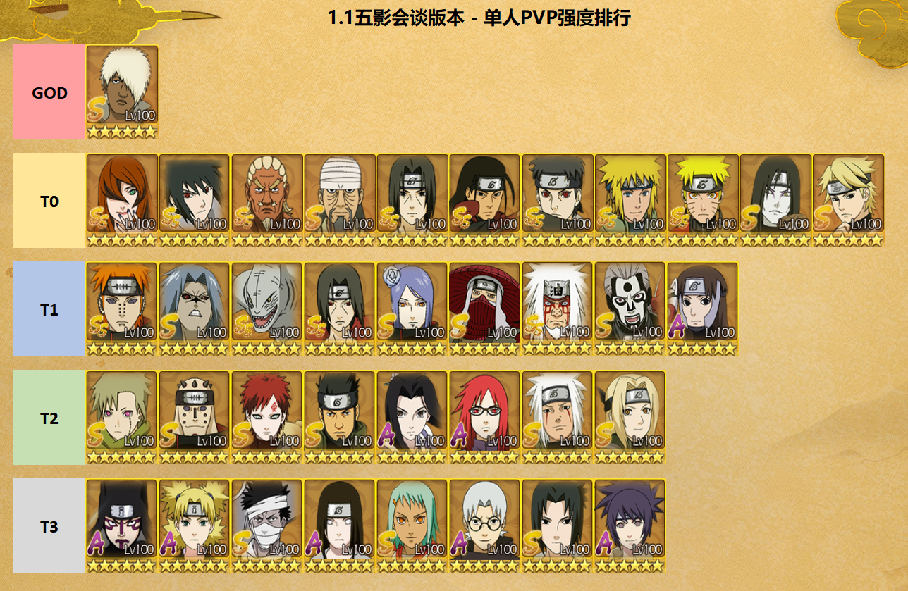
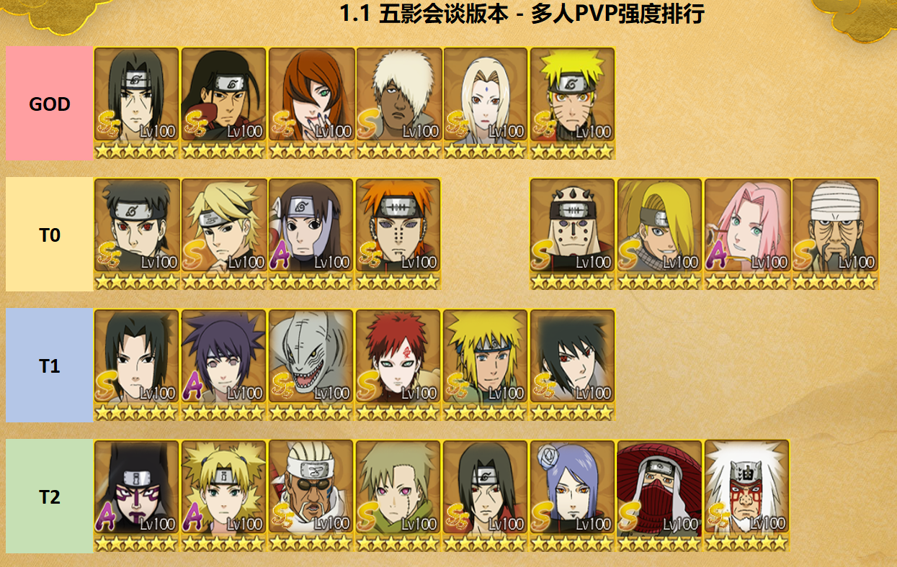
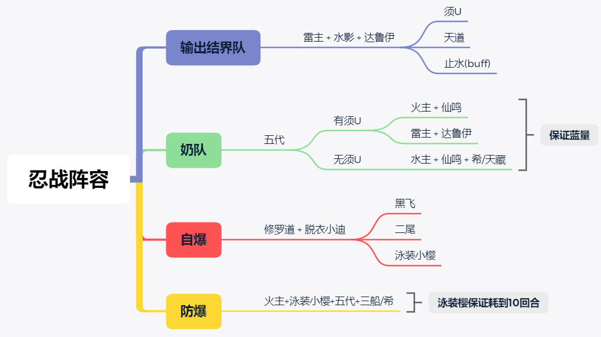
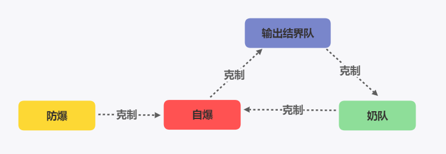
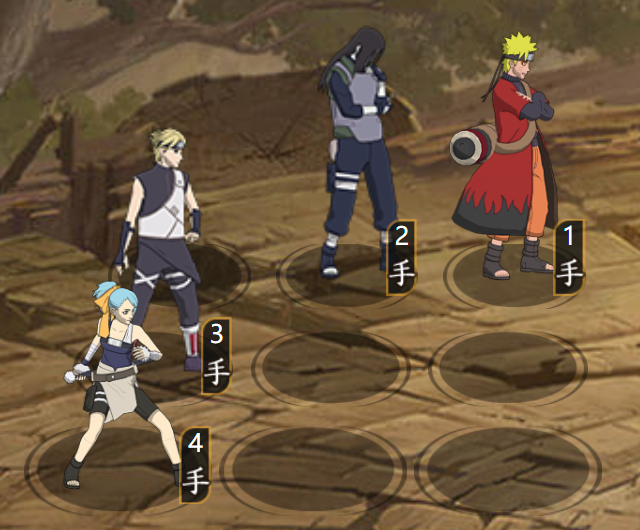
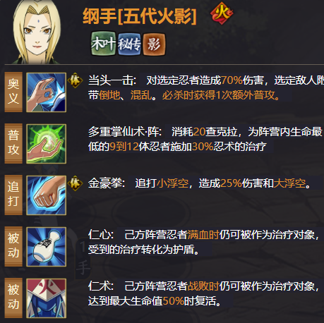

# 【忍者排行】第五期：五影会谈

本文引自：[【忍者排行】第五期：PVP强度排行 — 适用于五影会谈(雷水)版本](https://tieba.baidu.com/p/7176577714)

发表时间：2021-01-01

作者：其实加菲不是猫

一、排行标准
GOD：永远滴神
T0：主流阵容
T1：可用阵容
T2：新区推荐阵容
T3：新区过渡阵容（多人PVP删除T3）

二、目录说明

1、本排行仅适用于1.1五影会谈远征版本(和服止水/搅基奇拉比)，后续每个大版本会持续更新，下面楼层会有各阵容详细介绍。

2、除了排行榜大图外，下面各子模块分为版本变更分析、单人PVP阵容推荐、忍战PVP阵容推荐、新手推荐4个部分。

三、更新说明：

上榜了部分五影会谈部分新忍者(SS：艾、照美冥；S：达鲁伊、希、三船；和服止水和搅基奇拉比资源未上架官方模拟器，暂时无法更新)

四、往期链接：
【忍者排行】第一期：PVP强度排行 — 适用于5.15兄弟对决版本：https://tieba.baidu.com/p/6712998091

【忍者排行】第二期：PVE强度排行 — 适用于5.15兄弟对决版本：[https://tieba.baidu.com/p/6731842951](http://jump2.bdimg.com/safecheck/index?url=rN3wPs8te/q5OliqKZYDxPDqAWItH18D/FF0q+Kb9SFr74WvCooblWgrQFEwOKbMv3vMvg4+89LpNC+0mJUblqPw5az7WBWDmIeyDqCphExtJV5a+QapyZhOL1jpdtttBk0HoooHsb55z8Bn4gXBxDA8Zu4mdgY0)

【忍者排行】第三期：PVP强度排行 — 适用于6.26脱衣小迪版本：[https://tieba.baidu.com/p/6792809478](http://jump2.bdimg.com/safecheck/index?url=rN3wPs8te/q5OliqKZYDxPDqAWItH18D/FF0q+Kb9SGLbyZc9OIs+N3W4+GKE7Prv3vMvg4+89LpNC+0mJUblqPw5az7WBWDmIeyDqCphExtJV5a+QapyZhOL1jpdtttBk0HoooHsb55z8Bn4gXBxDA8Zu4mdgY0)

【忍者排行】第四期：PVP强度排行 — 适用于8.27青水版本：https://tieba.baidu.com/p/6930671954

## 一、版本变更分析

### 1.1 单人PVP：

由于达鲁伊的过于超模，单人PVP的思路变成了怎么用达鲁伊构建一个尽可能不被克制的阵容？

先攻高能抢结界的情况下，雷达鲁伊+水影须佐佐助是几乎最稳定的组合；先攻低抢不到结界的情况下封石三船+雷影/老牌风止水/仙鸣希蛇也是常见的选择，须U在单人PVP由于和大鲈鱼没有联动已经逐渐边缘化了，新出的和服止水是否能拯救须U还要看后续的开发。

### 1.2 多人PVP：

忍战环境由两边奶妈互奶，变成克制与反克制的环境。

1、输出阵毫无疑问须U达鲁伊水影高且暴力，但是雷队的缺乏回复很可能被对面中低战消耗变成田忌赛马。

2、自爆阵可以克制雷输出阵，但又会被防爆阵(泳樱)拖时间，或是被奶队白换。

3、奶队克制自爆和消耗队，又被输出阵克制，容易第二回合被强行带走。

详细分析第三章会讲，提前总结一下，没有零缺陷的阵容，一个优秀的组织首领会给忍战胜率带来质的提升。

## 二、单人PVP阵容分析

### Pre 阵容构建原则：

上一期还说到原则是“以强忍为核心，搭配SS/S忍辅助/补伤”，策划马上出了达鲁伊打脸。
从当前环境看阵容构建很简单，围绕着永远滴神来就可以了
1、高战：以达鲁伊为核心，搭配尽可能不被克制的阵容
2、中低战，搭配克制达鲁伊的阵容
3、新区（什么阵容都有）：青水仙鸣不会让你失望

### 2.1 高战阵容参考

高先攻高战就不推荐阵容了，只要不瞎玩不被针对想输都难，这里给一套万金油参考阵容，站位要灵活，根据本区环境布阵。

### 2.2 中低战克制阵容推荐

很多人怀疑三船有个卵用，输出低，对A不过别人，过了第一回合不是还被乱杀？
实际三船的作用是能给低先攻一个逆转的机会，如下图阵容面对上一个雷达鲁伊佐助水影阵容；第一回合三船大对方1手，对方1手的技能cd就会增加至3，对面就会由1357变成246，实现逆转。当前这套阵容也有很多破解的办法，可以在此楼讨论。
注：封石三船第一回合可以稳定放大，即使对方打断，三船自身的被动会将技能cd减至1，再加上封石可实现一回合两技能。

### 2.3 中低战万金油/坦克阵容推荐

如果不考虑针对性阵容，且是月卡/零氪党，建议把好钱用在刀刃上，放弃先攻和结界忍者(没先攻自然抢不过结界)。先攻比不过别人就等于没有，一入坦克教解千愁。
宇智波家族 = 氪金一家人，可以不用考虑；推荐低先攻走木叶坦克流，如土青水仙鸣蛇，或者水仙鸣蛇希
新出的自愈套装可以保证仙鸣第二回合可以稳定放大，仙鸣未来可期!

### 2.4 单人PVP总结

本期T0排了那么多人，并不是说这里面的所有角色强度都一样，要根据个人的先攻/属性/区内环境选择适合自己的阵容。
总结一下常用的阵容：
1、版本答案雷+达鲁伊+其它。
2、仙鸣 + 蛇= 白嫖的神，当前版本更推荐使用水主而不是土主，一方面土主被大环境雷克制，另一方面青水/止水这种220对新区是个很大负担，希便宜实用。
3、新区只推荐仙鸣，其它有什么用什么，一定不要强出雷影/青水/天道/须佐佐助/止水等角色！这是个养成游戏，养新不养旧。
4、阵容是死的，人是活的，一定要根据环境选阵容，一个黑飞用的好都能越战10w。

## 三、忍战阵容分析

### 3.1 阵容介绍

忍战主要分为四类阵容，克制关系如下，推荐主力阵容为1个输出结界队+2个奶队；或2输出队+1奶队

### 3.2 克制介绍

### 3.3 总结

1、结界队一个就够了，多带无益。建议最高先攻的输出队来抢结界，剩下两奶或者一奶一输出。

2、须U的阵容就不推荐新手了，这里只推荐一个奶，给大佬当挂件会比刮痧体验好很多。

3、不要带青水、仙自这种角色！！哪怕辅助甚至是自爆都比这些强。

4、复读机一下上期说过的问题，为什么推荐五代？

拿数据来算，五代纲手单次奶量9体×25%，两次普攻可以造成阵营共计450%的治疗，而青年纲手只能提供共计80%的治疗和40%的护盾，在忍战的表现差异是巨大的。

### 3.4、阵容介绍

忍战主要分为四类阵容，克制关系如下，推荐主力阵容为1个输出结界队+2个奶队；或2输出队+1奶队

#### 3.4.1. 须U队

基本跨服老区都是三个须U互砍，哪边先减员就意味着离输不远了，核心还是靠火主的忍术支援回血或者土主的开局盾保证安全，这里提供两套推荐阵容，最理想的还是1结界+2奶的队伍：

奶阵：火/土 + 须U + 五代 + 仙鸣

结界：火/土 + 须U + 初代 + 补位(仙鸣/须佐佐助/水门)

#### 3.4.2. 天道输出队

天道队的核心就是保护天道和增强天道，没什么好说的，都是老牌阵容了

土天道：土主 + 天道 + 小南 + 大罗

雷天道：雷主 + 天道 + 疾风/须佐佐助 + 小南/止水

#### 3.4.3. 仙人队

新区没须U没天道的玩家还是非常多的，没有核心多体输出，思路就是肉+奶+养成鸣人/保住水门

推荐：土/水主 + 仙自 + 仙鸣 + 五代

这里五代纲手和仙自可用青年水门/天藏/止水等部位

#### 3.4.4 自爆队

这套阵容非常适合中低战(相对)的平民，面对着3个须U，上面的仙人队简直是在刮痧+当靶子。这时自爆在战力差距不大且对面没奶的情况至少可以炸掉30%甚至更高的血量，给后续的队友铺路，强力推荐！

阵容火主+脱衣小迪+修罗道+替补

## 四、克制与反克制

## 五、新人培养

1、V16+土豪

所有忍者拉满，参考榜一阵容搭配即可。

2、V13-V15平民

8000忍者必备，强忍全拿，活动招募和封印招募不要乱拿，只拿有用的。

3、V12即以下月卡白嫖党

不推荐走高先攻的强攻结界流，建议走仙鸣为核心的木叶坦克队！

封印强忍优先级：推荐仙鸣，青水可以拿不推荐，仙自天道不要拿！
钥匙强忍优先级：有达鲁伊和水影推荐须佐佐助，没有的话不推荐，止水可以拿不推荐，晓U不要拿！
必备忍者：PVE—汉；PVP高先攻输出队—达鲁伊；PVP低先攻坦克队—仙鸣，青蛇，希
当前版本入坑路线：开局风+三姐弟+汉=>青蛇青纲希=>有仙鸣后换掉青纲

当前毕业阵容：土青水仙鸣青蛇(中期半肉半输出)，水仙鸣青蛇希 / 水仙鸣青纲希(后期纯肉养成)

除强忍/通行证和必备PVE忍者外，其余忍者均不推荐培养。

