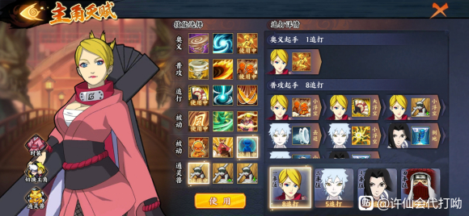
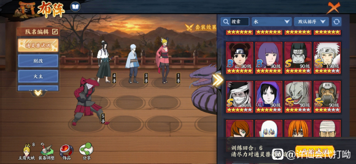
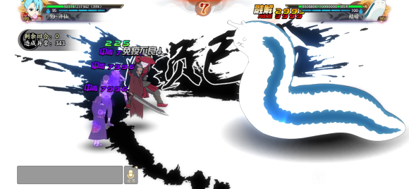

# 通灵兽试训

## 万蛇-追打试训

引自：[组织通灵兽——万蛇（追打试训）五级难度阵容推荐](https://tieba.baidu.com/p/7309252424)

发表时间：2021-04-19  

作者：代打小许

重点：风主疾风套其余轻风，第一回合一定要刷出镰鼬，不然后面很难搞

解析：五尾带清风是因为他的追打可以自打自追，风主带分身能保证连出镰鼬追打。与千代对比：具体我没怎么算，但我粗略估计，能刷出六个回合汉奥义或以上，是一定能比千代婆婆打得高的，毕竟浪白开局三追打（月光疾风两追打，没有浪白夜可以用月光疾风），后面叠加起来是比千代婆婆高的，新区也不用急着出千代这类收集忍者了。到了五级难度后已经没有进度条了，所以在这一难度打好即可，后续应该也不会提升难度了，不然就丰饶化了。

 

 

## 蛞蝓-异常试训

引自：[组织通灵兽——蛞蝓（异常试训）五级难度阵容推荐](https://tieba.baidu.com/p/7309246785)

发表时间：2021-04-19  

作者：代打小许

饰品：五尾查克拉，水主饿狼，暗部鼬傀儡套，晓蛇轻风（没有可用宇智波信代替）

重点：第一回合五尾奥义，追打刷出鲨鱼20查克拉再放晓蛇奥义即可（极限一点刷两个鲨鱼查克拉放水主大蛇丸奥义）后面自动就行。最终异常数由水主暴击数而产生细微差距。

 